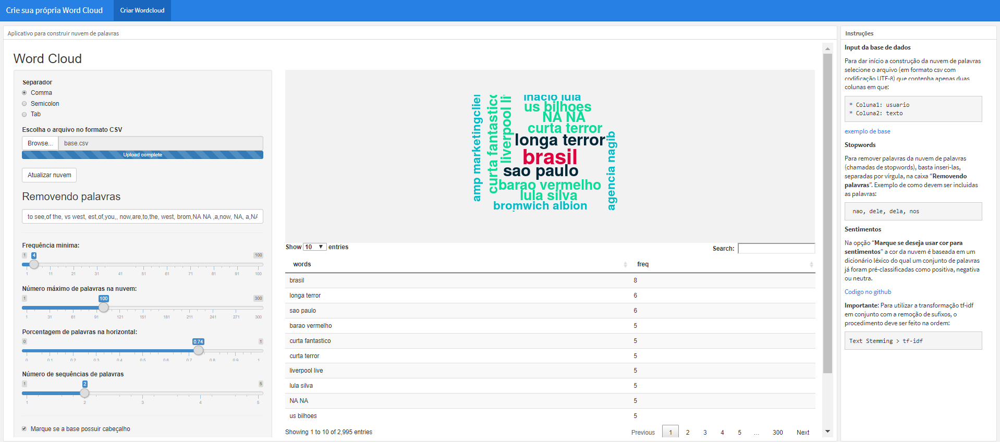
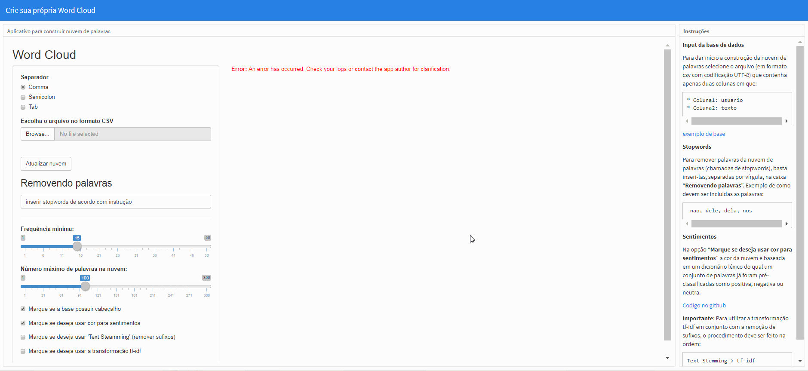
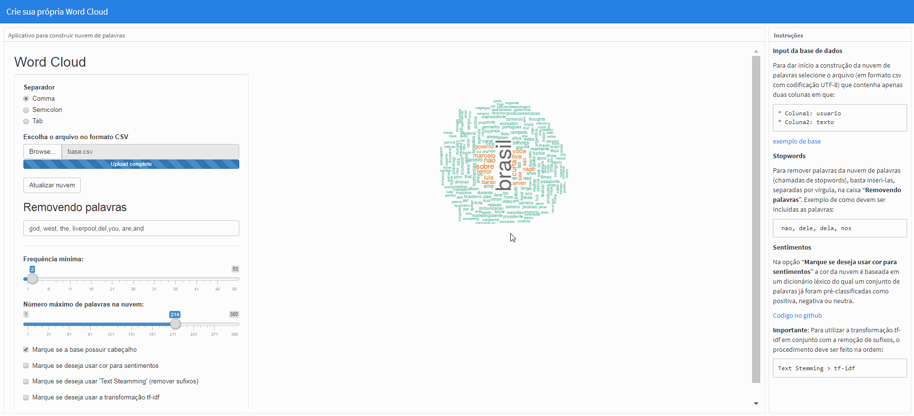
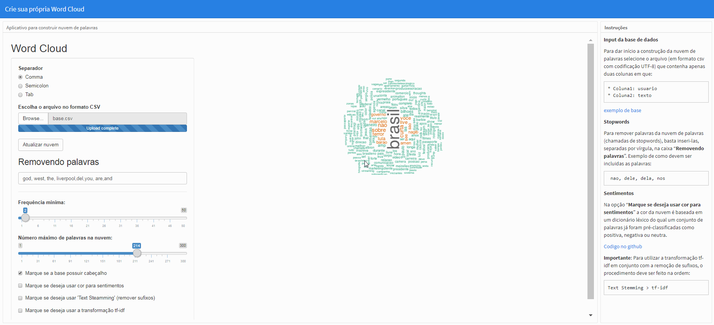
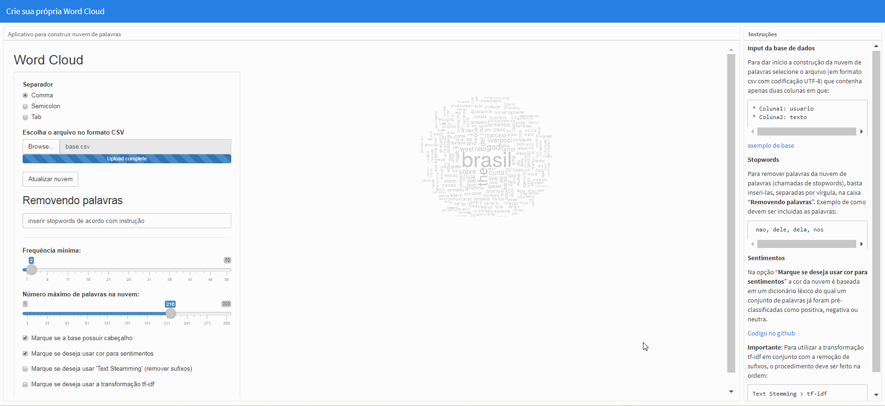

 

# Aplicativo para construir Wordcloud

NOVA VERSÃO DA NUVEM DE PALAVRAS!!

Nova versão conta agora com a tabela de frequências dos termos identificados na análise!

link do app: https://gomesfellipe.shinyapps.io/appwordcloud/

Esta pasta conta com os seguintes arquivos:

Base de dados (obtida através do [social searcher](https://www.social-searcher.com/)):
 - base.csv                            - exemplo de base de dados como input do aplicativo (obs.: codificação UTF-8)  

Complementos:
 - wordcloud_sentiment.R - Função criada para gerar nuvens de palavras com tecnicas textmining de maneira simples e facil
 - install_packages.R - Script para auxiliar na instalação dos pacotes necessários para rodar o aplicativo
  
Código do aplicativo:
 - appwordcloud.Rmd - Este é o código responsável por rodar o aplicativo

# Motivação para o aplicativo

Inicialmente uma função foi desenvolvida com finalidade de se criar nuvens de palavras em conjunto com técnicas de textmining de forma dinâmica, o nome da função é `wordcloud_sentiment()` e seu código e os parâmetros para seu uso podem ser conferidos no arquivo `wordcloud_sentiment.R`.

Com essa função foi possível que a criação de nuvens de palavras com técnicas de textmining se tornasse uma tarefa mais ágil, porém o conhecimento prévio de R para sua implementação seria recomendado caso necessite de alguma manutenção. Diante disto a ideia de uma abordagem mais interativa mostrou-se interessante, a seguir é possível conferir como foi sua implementação.

# Pacotes utilizados:

Os pacotes utilizados incluindo algumas referências:

  * `flexdashboard`: Pacote para gerar o aplicativo como dashboard ( [manual do pacote](https://rmarkdown.rstudio.com/flexdashboard/) )
  * `stringr`:       Pacote para manipulação de strings ([bom manual para manipular strings](http://material.curso-r.com/stringr/)  )   
  * `dplyr`:         Pacote para manipulação de dados ([Cheat Sheet para Data Wrangling](http://tidy.ws/29i5Kq))                       
  * `tm`:            Pacote de para text mining ([manual do CRAN](http://tidy.ws/29i5Lr))                       
  * `wordcloud`:     Pacote para nuvem de palavras ([bom manual para text mining, wordcloud e sentimentos](http://tidy.ws/29i5UO))       
  * `readxl`:        Pacote para leitura de dados Excel ([github tidyverse](https://github.com/tidyverse/readxl) )        
  * `tidytext`:      Manipulação de textos ([e-book tidytextmining](https://www.tidytextmining.com/))             
  * `reshape2`:      Manipulação de dados ( [github do hadley](https://github.com/hadley/reshape) )          
  * `lexiconPT`:     Importar palavras de sentimentos ( [CRAN](http://tidy.ws/29i5QU)     )                  
  * `memoise`:       Cache resultados de uma função ([github memoise](https://github.com/r-lib/memoise))            
  * `SnowballC`:     Para steamming ([manual do CRAN ](http://tidy.ws/29i61a))                       
  * `purrr`:         Ferramentas de programação funcional ([cheat Sheet para funcoes apply](http://tidy.ws/29i5WN )) 
  * `DT`:            Renderizar tabela ( [manual do pacote](https://rstudio.github.io/DT/)  )             
  * `ngram`:         Busca por sequencias de palavras ([guia para ngram no R](http://tidy.ws/29i607)   )                    

# Instalando os pacotes

A instalação de todos esses pacotes pode ser realizada em apenas 1 passo, para mais informações consultar o documento `install_packages.R` e seguir as instruções de instalação 

# Instruções

Obs.: As funções da nova versão são basicamente as mesmas da versão antiga. A novidade está na tabela de frequências dos termos identificados com disponibilidade para download.

## Input da base de dados

 

Para dar início a construção da nuvem de palavras selecione o arquivo (em formato csv com codificação UTF-8) que contenha apenas duas colunas em que:

    * Coluna1: usuario
    * Coluna2: texto

[exemplo de base](https://github.com/gomesfellipe/appwordcloud/blob/master/base.csv)

## Stopwords

 

Para remover palavras da nuvem de palavras (chamadas de stopwords), basta inseri-las, separadas por vírgula, na caixa "**Removendo palavras**". Exemplo de como devem ser incluidas as palavras:

     nao, dele, dela, nos

## Sentimentos

 

Na opção "**Marque se deseja usar cor para sentimentos**" a cor da nuvem é baseada em um dicionário léxico do qual um conjunto de palavras já foram pré-classificadas como positiva, negativa ou neutra. Por default a nuvem já começa com esta opção marcada.

## TextSteamming (remover sufixos)

Com a opção "Marque se deseja usar 'Text Steamming'(remover sufixos)" marcada, a função ` SnowballC::wordStem(x,lang="portuguese)` será utilizada de forma que as palavras em portugues do Brasil tenham seus sufixos removidos, o que influencia na análise de forma que, por exemplo, as palavras "conhecimento", "conhecer", "conhecemos", "conheci" sejam agregadas em um único termo: "conhec", veja:

 

Obs.: Para efetuar a mudança, clique em "Atualizar nuvem"

## TF-IDF

A opção "Marque se deseja usar a transformação tf-idf" realizará q [transformação if-idf](https://pt.wikipedia.org/wiki/Tf%E2%80%93idf) na matriz de termos que não considera mais a frequência (ou contagem) de termos de modo que as palavras tenham "pesos" atribuídos que levam em consideração não só a frequência das palavras no corpus, mas também a frequência das palavras nos diferentes documentos (cada linha da base de dados). Este valor agora será encarregado de fornecer a "relevância" daquele termo no corpus.

 

Obs.: Para efetuar a mudança, clique em "Atualizar nuvem"

## Salvando a Wordcloud

Para salvar, basta clicar sobre a imagem e salvar, veja:

 
 
 ## Fazendo o Download (novidade!)
 
 Agora o usuário pode baixar também a tabela de frequência dos termos identificados clicanco no botão `download`
 
---

