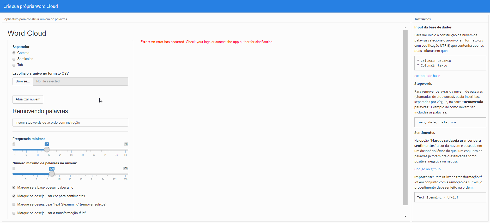
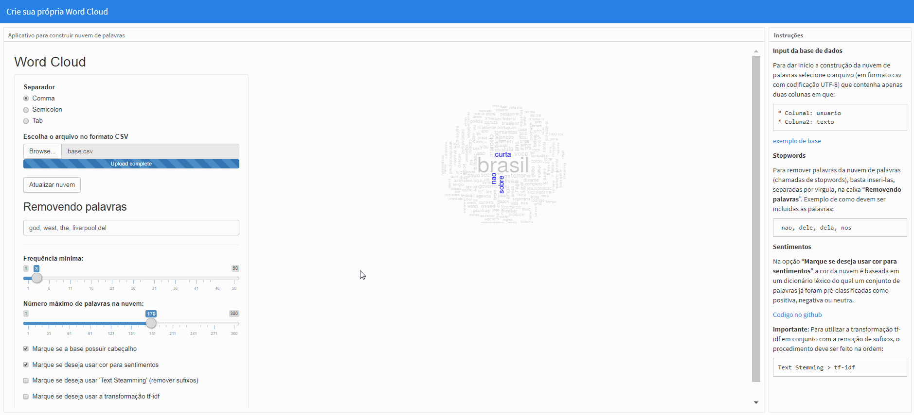

# APPWORDCLOUD

link do app: https://gomesfellipe.shinyapps.io/appwordcloud/

Este é um aplicativo criado via RStudio que permite que o usuário carregue sua própria base de dados (em formato UTF-8) e crie sua própria núvem de palavras e tenha a liberdade de escolher dentre algumas opções de text minig como será a nuvem desejada.

### Instruções

**Input da base de dados**

 

Para dar início a construção da nuvem de palavras selecione o arquivo (em formato csv com codificação UTF-8) que contenha apenas duas colunas em que:

    * Coluna1: usuario
    * Coluna2: texto

[exemplo de base](https://github.com/gomesfellipe/appwordcloud/blob/master/base.csv)

**Stopwords**

 

Para remover palavras da nuvem de palavras (chamadas de stopwords), basta inseri-las, separadas por vírgula, na caixa "**Removendo palavras**". Exemplo de como devem ser incluidas as palavras:

     nao, dele, dela, nos

**Sentimentos**

 

Na opção "**Marque se deseja usar cor para sentimentos**" a cor da nuvem é baseada em um dicionário léxico do qual um conjunto de palavras já foram pré-classificadas como positiva, negativa ou neutra. Por default a nuvem já começa com esta opção marcada.

**TextSteamming (remover sufixos)**

Com a opção "Marque se deseja usar 'Text Steamming'(remover sufixos)" marcada, a função ` SnowballC::wordStem(x,lang="portuguese)` será utilizada de forma que as palavras em portugues do Brasil tenham seus sufixos removidos, o que influencia na análise de forma que, por exemplo, as palavras "conhecimento", "conhecer", "conhecemos", "conheci" sejam agregadas em um único termo: "conhec", veja:

 

Obs.: Para efetuar a mudança, clique em "Atualizar nuvem"

**TF-IDF**

A opção "Marque se deseja usar a transformação tf-idf" realizará q [transformação if-idf](https://pt.wikipedia.org/wiki/Tf%E2%80%93idf) na matriz de termos que não considera mais a frequência (ou contagem) de termos de modo que as palavras tenham "pesos" atribuídos que levam em consideração não só a frequência das palavras no corpus, mas também a frequência das palavras nos diferentes documentos (cada linha da base de dados). Este valor agora será encarregado de fornecer a "relevância" daquele termo no corpus.

 

Obs.: Para efetuar a mudança, clique em "Atualizar nuvem"

**Salvando a Wordcloud**

Para salvar, basta clicar sobre a imagem e salvar, veja:

 
 
---

**Importante**: Para utilizar a transformação tf-idf em conjunto com a remoção de sufixos, o procedimento deve ser feito na ordem: 

    Text Stemming > tf-idf
